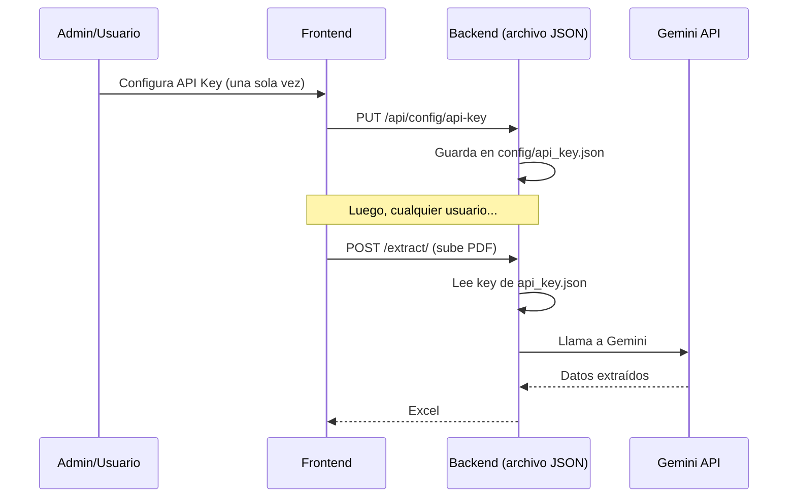

# API Key de Gemini — Configuración Centralizada desde el Frontend

## Descripción

La API key de Gemini se almacena **una sola vez en el backend** (en un archivo JSON persistente). Un administrador la configura desde el frontend y todos los usuarios del sistema la comparten. No hay sistema de usuarios ni autenticación.

## Flujo



## Proposed Changes

### Backend — Nuevo Router de Configuración

#### [NEW] [config_router.py](file:///c:/Users/USUARIO/sena/DocumentosPython/backend/routers/config_router.py)

Endpoints CRUD para la API key:

| Método | Ruta | Descripción |
|--------|------|-------------|
| `GET` | `/api/config/api-key` | Retorna si hay key configurada (no la key en sí, solo `{ "configured": true/false, "masked": "AIza...Kt0" }`) |
| `PUT` | `/api/config/api-key` | Guarda o actualiza la key |
| `DELETE` | `/api/config/api-key` | Elimina la key guardada |

---

### Backend — Servicio de Almacenamiento de la Key

#### [NEW] [api_key_store.py](file:///c:/Users/USUARIO/sena/DocumentosPython/backend/services/api_key_store.py)

Servicio simple que guarda/lee la API key en un archivo JSON:
- `save_api_key(key)` → guarda en `config/api_key.json`
- `get_api_key()` → lee la key (primero del archivo, fallback al `.env`)
- `delete_api_key()` → borra el archivo
- `is_configured()` → retorna `True/False`
- `get_masked_key()` → retorna `"AIza...Kt0"` (primeros 4 + últimos 3 caracteres)

---

### Backend — Modificar Batch Processor

#### [MODIFY] [batch_processor.py](file:///c:/Users/USUARIO/sena/DocumentosPython/backend/services/batch_processor.py)

- En `process_pages_batch()`: en vez de leer `GEMINI_API_KEY` del `.env`, llamar a `api_key_store.get_api_key()`
- Si no hay key configurada, lanzar error claro

---

### Backend — Modificar AI Service

#### [MODIFY] [ai_service.py](file:///c:/Users/USUARIO/sena/DocumentosPython/backend/services/ai_service.py)

- En `get_client()`: obtener la key desde `api_key_store.get_api_key()` en vez del `.env`
- Eliminar el singleton global (la key puede cambiar si el admin la actualiza)

---

### Backend — Modificar Settings

#### [MODIFY] [settings.py](file:///c:/Users/USUARIO/sena/DocumentosPython/backend/config/settings.py)

- Hacer `gemini_api_key` opcional (`Field(default="")`) para que el servidor arranque sin key en `.env`

---

### Backend — Registrar nuevo router

#### [MODIFY] [main.py](file:///c:/Users/USUARIO/sena/DocumentosPython/backend/main.py)

- Importar e incluir el nuevo `config_router`

---

### Frontend — Store

#### [MODIFY] [extraction.js](file:///c:/Users/USUARIO/sena/DocumentosPython/frontend/src/stores/extraction.js)

- Agregar estado: `apiKeyConfigured`, `apiKeyMasked`
- Agregar acciones: `fetchApiKeyStatus()`, `saveApiKey(key)`, `deleteApiKey()`

---

### Frontend — Página Principal

#### [MODIFY] [Home.vue](file:///c:/Users/USUARIO/sena/DocumentosPython/frontend/src/pages/Home.vue)

Agregar un **panel de configuración de API key** encima de la zona de upload:

- Si **NO hay key**: muestra un formulario para ingresarla con enlace a Google AI Studio
- Si **hay key**: muestra la key enmascarada (`AIza...Kt0`) con botones para **cambiar** o **eliminar**
- Deshabilitar "Extraer Datos" si no hay key configurada

El panel será discreto (colapsable o tipo banner) para no estorbar al uso diario.

---

## Estructura del archivo de configuración

```
backend/
  config/
    api_key.json     ← NUEVO (se crea automáticamente)
```

Contenido de `api_key.json`:
```json
{
  "gemini_api_key": "AIzaSy...",
  "updated_at": "2026-05-22T21:30:00"
}
```

Este archivo se agrega al `.gitignore` para no commitear la key.

---

## Verification Plan

### Pruebas
1. Arrancar backend sin key en `.env` ni archivo JSON → debe arrancar OK
2. `GET /api/config/api-key` → `{ "configured": false }`
3. `PUT /api/config/api-key` con body `{ "api_key": "AIza..." }` → guarda y retorna OK
4. `GET /api/config/api-key` → `{ "configured": true, "masked": "AIza...xxx" }`
5. Subir un PDF → debe funcionar con la key guardada
6. `DELETE /api/config/api-key` → borra la key
7. Subir un PDF sin key → error 400 claro
8. Frontend: verificar panel de configuración, enmascarado, y flujo completo
